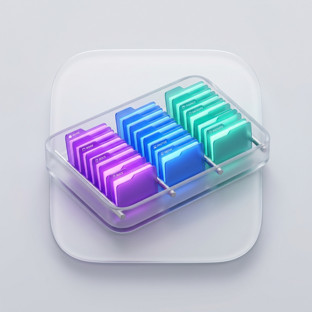
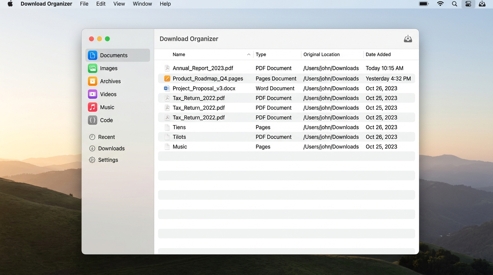

<p align="center">
  
</p>

<h1 align="center">Declutter</h1>

<p align="center">
  <strong>Intelligent, privacy-first file organization for macOS.</strong><br>
  Sort your Downloads, Desktop, or any messy folder automatically with smart rules, live preview, and instant undo.
</p>

<p align="center">
  <a href="https://github.com/OWNER/declutter/releases/latest"></a>
  
  
  
  
</p>

<p align="center">
  
</p>

---

## ✨ Highlights

Declutter runs quietly in the background or on demand to keep your workspaces pristine. Rather than treating all folders like a generic junk drawer, Declutter puts you in control with precise, transparent rules.

| Feature | Description |
|:---|:---|
| 📂 **Any Folder** | Watch Downloads, Desktop, Screenshots, or custom working directories. |
| 🏷️ **Smart Categorization** | Sort by file type, extension, regex, creation/modification dates, file size, and more. |
| 👁️ **Live Monitoring** | FSEvents background daemon with stability checking so files are never moved mid-download. |
| ↩️ **Atomic Undo** | Every move is journaled. Revert single files or roll back entire batches in one click. |
| 🔍 **Dry Run & Preview** | Preview destination paths, detect rule conflicts, and verify moves before touching disk. |
| ⚡ **Menu Bar Companion** | Discreet menu bar extra gives instant status, pause/resume toggling, and quick scans. |
| 🛡️ **100% Offline & Private** | Zero telemetry, zero analytics, zero network requests. Your files and metadata never leave your Mac. |

---

## 🚀 Quick Start & Download

### Option 1: Direct Download (DMG)

1. Head over to [**Latest Releases**](https://github.com/OWNER/declutter/releases/latest).
2. Download `Declutter-0.1.0.dmg`.
3. Open the DMG and drag **Declutter** to your **Applications** folder.
4. Launch **Declutter** from Applications or Spotlight.

> [!TIP]
> **First-Launch Gatekeeper Notice (for Ad-Hoc Builds):**
> Because this open-source build is distributed directly without a paid Apple Developer certificate, macOS Gatekeeper may show a verification prompt on first open.
> - **Method A:** Right-click (or Control-click) **Declutter.app** → click **Open** → confirm **Open**.
> - **Method B (Terminal):**
>   ```bash
>   xattr -dr com.apple.quarantine /Applications/Declutter.app
>   ```

---

### Option 2: Homebrew Cask (Coming Soon)

```bash
brew install --cask declutter
```

---

## 🎯 How It Works

```
📁 Source Folder (e.g. ~/Downloads)
       │
       ▼
   [File Scanner] ───► Evaluates Rules (Type, Extension, Size, Date, Regex)
       │
       ├───► [Live Preview] ───► Review proposed destinations & conflicts
       │
       ▼
   [Move Engine] ──────► Atomic file relocation with journal logging
       │
       ▼
   [Full Undo] ────────► Undo any move at any time from Activity Log
```

1. **Pick Folders:** Select `~/Downloads`, `~/Desktop`, or custom paths via secure macOS bookmarks.
2. **Choose or Compose Rules:** Use pre-packaged presets (Documents, Images, Archives, Code, Videos, Audio) or create custom logic with nested conditions.
3. **Scan & Confirm:** Preview planned moves with transparent match explanations.
4. **Automate:** Switch on background monitoring for hands-free sorting.

---

## ⌨️ Keyboard Shortcuts

| Shortcut | Action |
|:---|:---|
| <kbd>⌘</kbd> + <kbd>N</kbd> | Create New Category |
| <kbd>⌘</kbd> + <kbd>R</kbd> | Rescan Monitored Folder |
| <kbd>⌘</kbd> + <kbd>Return</kbd> | Execute Organization Batch |
| <kbd>⌘</kbd> + <kbd>F</kbd> | Search Rules & Files |
| <kbd>⌥</kbd> + <kbd>⌘</kbd> + <kbd>P</kbd> | Pause / Resume Background Watcher |
| <kbd>⌘</kbd> + <kbd>Z</kbd> | Undo Last Batch |

---

## 💻 Building From Source

### Prerequisites
- macOS 14.0 (Sonoma) or later
- [Xcode 16+](https://developer.apple.com/xcode/)
- [XcodeGen](https://github.com/yonaskolb/XcodeGen) (`brew install xcodegen`)

### Build Steps

```bash
# 1. Clone repository
git clone https://github.com/OWNER/declutter.git
cd declutter

# 2. Generate Xcode project
xcodegen generate

# 3. Build with xcodebuild (or open Declutter.xcodeproj in Xcode)
xcodebuild -project Declutter.xcodeproj -scheme Declutter -destination 'platform=macOS' build
```

### Run Package Tests

All business logic, classification engines, and file monitors are headless and testable via SwiftPM:

```bash
swift test --package-path Packages/DeclutterCore
```

---

## 🏗️ Architecture

```
Declutter/
├── App/                      # SwiftUI app & menu bar interface
│   ├── UI/                   # Views: Dashboard, Rules, Preview, Activity, Settings
│   ├── Monitoring/           # App lifecycle, notifications, settings
│   └── Support/              # Entitlements, Info.plist
├── Packages/
│   └── DeclutterCore/        # Pure Swift package with 100% UI-free logic
│       ├── Sources/
│       │   ├── Domain/       # Category, Rule, and File models
│       │   ├── Rules/        # AST evaluation, overlap detection, presets
│       │   ├── FileSystem/   # Safe move engine, conflict resolvers, scanner
│       │   ├── Monitoring/   # FSEvents stream with download stability checks
│       │   └── History/      # Journaling and rollback undo manager
│       └── Tests/            # Comprehensive unit and integration test suite
├── Scripts/                  # Release packaging, appcast, and DMG tooling
└── .github/workflows/        # Automated CI and release pipelines
```

---

## 🔒 Privacy & Security

Declutter was built from the ground up on privacy-by-design principles:
- **No Analytics / No Tracking:** Zero tracking SDKs or telemetry.
- **Local Metadata Only:** The app inspects filenames, extensions, byte sizes, and timestamps. It never inspects, uploads, or modifies the contents of your files.
- **App Sandbox & Hardened Runtime:** Respects macOS security boundaries with user-granted directory bookmarks.

---

## 📄 License

Distributed under the [MIT License](LICENSE).
